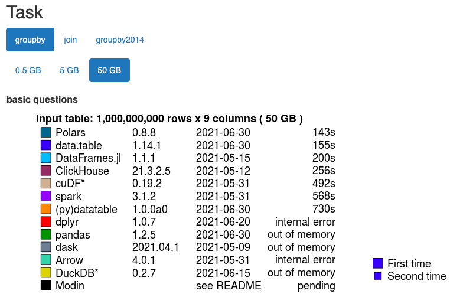

```{r setup, include=FALSE}
knitr::opts_chunk$set(echo = FALSE)
```

## Agenda

- **Background on data.table** what it’s for, who’s behind it, and how does it fit into the tidyverse
- **Intro to data.table objects and syntax**
- **Data manipulation with data.table** how to subset, extract, summarize, group, etc
- **An in-class exercise**

# Quick Background {.bigger}

## Background on data.table
*What is a data.table?*\
A data.table is basically a data frame object with an upgrade. Saving a dataset as a data.table object allows you to use any packages or functions you typically use with data frames, like dplyr, as well as all the data.frame package functionality.

*Why would I use data.table package functions over something else?*\
The language is pretty concise and you may find it more intuitive. It’s also memory-efficient and fast, making it a good choice for exploring very large datasets. 

## [It really is fast](https://h2oai.github.io/db-benchmark/)


## The skinny on data.table
- Created by Matt Dowle and Arun Srinivasan, with contributions from many others.
- Only dependent on base R, though used directly by hundreds of other CRAN packages. Very stable. 
- See https://rdatatable.gitlab.io/data.table/ for more info.

<div align="right">
<br>

</div>

# data.table objects and syntax {.bigger}

## Creating a data.table object

Creating a data.table object is easy!

`library(data.table)`\
`example_dt <- data.table(your_dataset)`

Note on loading your dataset: `fread()` 
- Same functionality as `read.csv()`
- Just much faster. Great for reading very large datasets. 

## The data.table syntax

`your_dataset[i, j, by]`\
            ` |  |  |`\
            ` |  |  --> grouped by`\
             `|  -----> columns/computations`\
             `--------> rows`

- Uses the familiar, base R [ ] notation for subsetting
- Note the commas!
- Remember: *“i” am the wal-rows*
<div align ="right">


</div>

## Quick intro to the Coronavirus Dataset
This dataset is a built-in with the `coronavirus` package, covering covid-19 cases by country, pulled from the Johns Hopkins University Center for Systems Science and Engineering.\

It's already in long, tidy format, and it's pretty massive: **518,682 observations** of 15 variables, making it a great candidate for looking at with data.table. *Note that there are some anomalies in the data due to changes in reporting practices and methodologies, such as when false positives were removed.*\

# Data manipulation
<div class="white">
- Subsetting rows
- Extracting columns
- Calculating Summary Statistics
- Grouping
</div>

## Subsetting Rows
`your_dataset[i, j, by]`\
            ` |  |  |`\
            ` |  |  --> grouped by`\
             `|  -----> columns/computations`\
             `--------> rows`\
             
We're using **i** for subsetting rows. Note that the commas aren’t strictly 
necessary now, but are useful for clarity.

## Subsetting Rows

`your_dataset[i, j, by]`\
            ` |  |  |`\
            ` |  |  --> grouped by`\
             `|  -----> columns/computations`\
             `--------> rows`\

Examples: \
`your_dataset[1:5, ]  # Subset first 5 rows`\
`your_dataset[-(1:5), ] # Subset everything but first 5 rows`\

`your_dataset[.N, ] # Returns the last row.` \
“.N” is  useful, giving us the integer number of rows in the data.table. \

`your_dataset[city_name == “Berlin”, ] # Returns all rows that match a variable value.`\
Can use logical expressions, as in dplyr::filter().

## Subsetting Rows - Logical Operators
`< , > , <== , >==` \
`is.na() , !is.na()` \
`%in%` \
`| , &` \

**Special data.table() operators:** \
`%like%`			← Allows searching for patterns in char or factor \
Example: `dt[species %like% “bat”,]`

`%between%`		← Allows searching for values within a closed interval \
Example: `dt[pop %between% c(2500, 5000),]`

Let's try this in R!

## Extracting Columns

`your_dataset[i, j, by]`\
            ` |  |  |`\
            ` |  |  --> grouped by`\
             `|  -----> columns/computations`\
             `--------> rows`\
             
Now we’re using **j**, which refers to columns.
Remember that **j** takes vectors of variable names as “character” \
... *(and remember the commas!)*


## Extracting Columns
`your_dataset[i, j, by]`\
            ` |  |  |`\
            ` |  |  --> grouped by`\
             `|  -----> columns/computations`\
             `--------> rows`\

Examples: \
` ans <- your_dataset[, .(country,cases)]`\
`# the "." stands in for list() here` \
` ans <- dt[, c(1, 4)] `\
`# Can specify column number` \

**Note**: extracted columns will save to a data.table object, not a vector.

## Calculating Summary Statistics 
`your_dataset[i, j, by]`\
            ` |  |  |`\
            ` |  |  --> grouped by`\
             `|  -----> columns/computations`\
             `--------> rows`\

In data.table, you can run computations directly in j. Easiest example to start with is calculating summary statistics. \
Example: `your_dataset[, mean(pop)]` \

You can also easily add a filter in **i** to narrow your results: \
Example: `your_dataset[species == "bat", mean(pop)]`

## Calculating Summary Statistics + Creating New Columns
`your_dataset[i, j, by]`\
            ` |  |  |`\
            ` |  |  --> grouped by`\
             `|  -----> columns/computations`\
             `--------> rows`\
**j** also allows you to create new columns easily. 

Example: \
`your_dataset[, gdp_per_capita := gdp/pop]`\
This creates a new calculated column: `gdp_per_capita`

Let's take a closer look at using **j** in R. 

## Grouping with the "by" argument
`your_dataset[i, j, by]`\
            ` |  |  |`\
            ` |  |  --> grouped by`\
             `|  -----> columns/computations`\
             `--------> rows`\
             
Similar to `dplyr::group_by()`, this argument allows you to group your results by a given categorical variable. \

Example: \
`your_dataset[, gdp_per_capita := gdp/pop, by = continent]`\
This creates a new calculated column `gdp_per_capita` and then groups by the continent.

## Credits/Sources
- On data.table:
  - https://rdatatable.gitlab.io/data.table/
  - https://cran.r-project.org/web/packages/data.table/vignettes/datatable-intro.html
  - https://app.datacamp.com/learn/skill-tracks/data-manipulation-with-r
- Building this presentation:
  - https://bookdown.org/yihui/rmarkdown/ioslides-presentation.html
- Coronavirus dataset
  - https://ramikrispin.github.io/coronavirus/
  - https://github.com/CSSEGISandData/COVID-19

## Exercises
- Go to "Exercises - Manipulation with data using data.table.Rmd" to start
- Note you'll have to install "coronavirus" and "data.table" packages
- `data("coronavirus")` loads the relevant dataset
- Make use of the data.table cheatsheet! It's linked under add'l sources on the readme file. 
