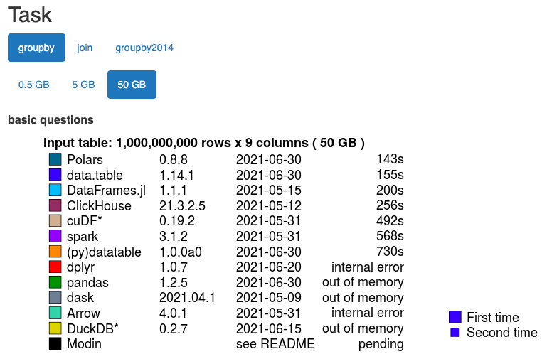

```{r setup, include=FALSE}
knitr::opts_chunk$set(echo = FALSE)
```

## Agenda

- **Background on data.table** what it’s for, who’s behind it, and how does it fit into the tidyverse
- **Intro to data.table objects and syntax**
- **Data manipulation with data.table** how to subset, extract, summarize, group, etc
- **Computations with data.table**

# Quick Background {.bigger}

## Background on data.table
*What is a data.table?*
A data.table is basically a data frame object with an upgrade. Saving a dataset as a data.table object allows you to use any packages or functions you typically use with data frames, like dplyr, as well as all the data.frame package functionality.

*Why would I use data.table package functions over something else?*
The language is pretty concise and you may find it more intuitive. It’s also memory-efficient and fast, making it a good choice for exploring very large datasets. 

## [It really is fast](https://h2oai.github.io/db-benchmark/)


## The skinny on data.table
- Created by Matt Dowle and Arun Srinivasan, with contributions from many others.
- Only dependent on base R, though used directly by hundreds of other CRAN packages. Very stable. 
- See https://rdatatable.gitlab.io/data.table/ for more info.

<div align="right">
<br>

</div>

# Quick Background {.bigger}

```{r pressure}
plot(pressure)
```

